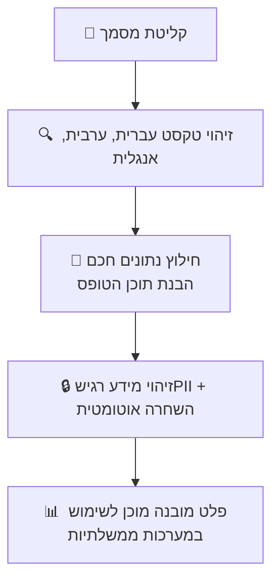

<div dir="rtl" align="right">

# GovDoc AI Israel
## מסמך איפיון מוצר — פלטפורמת בינה מלאכותית לעיבוד מסמכים ממשלתיים

---

## 1. הרעיון

**GovDoc AI Israel** היא פלטפורמה לעיבוד מסמכים חכם, שנבנית במיוחד עבור גופים ממשלתיים בישראל.

### מה המוצר עושה?

הפלטפורמה מקבלת מסמכים (סרוקים, PDF, תמונות) ומבצעת:



### למי המוצר מיועד?

- משרדי ממשלה (מס הכנסה, ביטוח לאומי, משרד הפנים)
- רשויות מקומיות
- גופים ציבוריים וסטטוטוריים

---

## 2. הבעיה

### המצב הקיים בגופים ממשלתיים

**מיליוני מסמכים מעובדים ידנית כל שנה:**

| גוף            | סוגי מסמכים                             | היקף שנתי משוער |
| -------------- | --------------------------------------- | --------------- |
| רשות המסים     | טפסי מס, דוחות, אישורים                 | 10+ מיליון      |
| ביטוח לאומי    | תביעות, אישורים רפואיים                 | 5+ מיליון       |
| משרד הפנים     | בקשות לת.ז., דרכונים, רישיונות          | 3+ מיליון       |
| בתי משפט       | כתבי טענות, פסקי דין, פרוטוקולים        | 2+ מיליון       |
| רשויות מקומיות | היתרי בנייה, רישיונות עסק, פניות אזרחים | 5+ מיליון       |

**התוצאה:**
- עובדים מקלידים ידנית נתונים מטפסים למערכות
- שיעור שגיאות גבוה בהקלדה
- צווארי בקבוק בתקופות עומס
- אזרחים מחכים שבועות לטיפול בבקשות

### העלות של המצב הקיים (לא נתונים אמיתיים*)

| סעיף                        | עלות שנתית משוערת |
| --------------------------- | ----------------- |
| עבודה ידנית של עיבוד מסמכים | ₪500M+            |
| שגיאות ותיקונים             | ₪50-100M          |
| עיכובים ואובדן פרודוקטיביות | לא ניתן לכימות    |
| **סה"כ**                    | **₪550-600M+**    |
* נצטרך לחקור ולהביא נתונים אמיתיים לצורך מכירה וכו׳
---

## 3. הפתרון — יכולות המוצר

### יכולות ליבה (MVP)

#### 3.1 זיהוי טקסט מודפס (OCR)
> **היכולת הבסיסית של המוצר**

| תכונה        | פירוט                                  |
| ------------ | -------------------------------------- |
| שפות נתמכות  | עברית, ערבית, אנגלית                   |
| סוגי מסמכים  | טפסים, מכתבים, דוחות, טבלאות, חשבוניות |
| פורמטים      | PDF, תמונות (JPG, PNG), סריקות         |
| איכות סריקה  | תמיכה בסריקות באיכות נמוכה עד גבוהה    |
| רמת דיוק יעד | 98%+ לטקסט מודפס                       |

#### 3.2 חילוץ נתונים מתקדם מטפסים
> **הבנה חכמה של תוכן המסמך**

| תכונה          | פירוט                                                |
| -------------- | ---------------------------------------------------- |
| זיהוי שדות     | זיהוי אוטומטי של שדות בטופס (שם, ת.ז., כתובת, תאריך) |
| הבנת תוכן      | הבנה של משמעות השדות והקשר ביניהם                    |
| טפסים ישראליים | התאמה מובנית לטפסי מס הכנסה, ביטוח לאומי, משרד הפנים |
| וידוא נתונים   | בדיקת תקינות (פורמט ת.ז., תאריכים, מספרי טלפון)      |
| פלט מובנה      | נתונים מובנים (JSON) מוכנים להעברה למערכות           |

**דוגמה:**
```
קלט: טופס 101 סרוק

פלט:
{
  "שם_פרטי": "ישראל",
  "שם_משפחה": "ישראלי",
  "תעודת_זהות": "123456789",
  "תאריך_לידה": "1985-03-15",
  "כתובת": "רחוב הרצל 10, תל אביב",
  "סטטוס_משפחתי": "נשוי",
  ...
}
```

#### 3.3 יכולות פרטיות והגנת מידע
> **עמידה בתיקון 13 לחוק הגנת הפרטיות**

| תכונה             | פירוט                                                |
| ----------------- | ---------------------------------------------------- |
| זיהוי PII אוטומטי | זיהוי מספרי ת.ז., כתובות, מידע רפואי, פרטים פיננסיים |
| השחרה אוטומטית    | יכולת להסתיר/למחוק מידע רגיש לפני שיתוף או אחסון     |
| תיעוד גישה        | לוג מלא של מי צפה באיזה מסמך, מתי, ומה עשה           |
| שליטה בהרשאות     | הגדרת מי יכול לראות מה                               |

#### 3.4 אבטחה ושמירת נתונים בישראל
> **דרישת סף לעבודה עם גופים ממשלתיים**

| תכונה        | פירוט                                       |
| ------------ | ------------------------------------------- |
| מיקום נתונים | שמירה בישראל בלבד (תשתית פרויקט **נימבוס**) |
| הצפנה        | הצפנה בתעבורה (TLS) ובאחסון (AES-256)       |
| גיבוי        | גיבוי אוטומטי עם יכולת שחזור                |
| תקנים        | עמידה בדרישות אבטחת מידע ממשלתיות           |

#### 3.5 ממשק משתמש בעברית
> **חוויית משתמש מותאמת**

| תכונה         | פירוט                                    |
| ------------- | ---------------------------------------- |
| שפת ממשק      | עברית מלאה (RTL)                         |
| העלאת מסמכים  | גרירה ושחרור, העלאה מרובה                |
| צפייה בתוצאות | תצוגה של המסמך המקורי לצד הנתונים שחולצו |
| עריכה ותיקון  | יכולת לתקן שגיאות זיהוי                  |
| ייצוא         | הורדת נתונים ב-Excel, CSV, JSON          |

#### 3.6 דשבורד בסיסי
> **מעקב ובקרה**

| תכונה      | פירוט                              |
| ---------- | ---------------------------------- |
| סטטיסטיקות | כמות מסמכים שעובדו, אחוזי הצלחה    |
| מעקב סטטוס | סטטוס עיבוד בזמן אמת               |
| שגיאות     | זיהוי מסמכים שדורשים התערבות ידנית |
| דוחות      | ייצוא נתונים בסיסי                 |

---

### יכולות מתקדמות (פיתוח עתידי)

#### 🔜 זיהוי כתב יד בעברית
> **יכולת ייחודית**

| תכונה        | פירוט                                     |
| ------------ | ----------------------------------------- |
| סוגי כתב יד  | שדות קצרים (שמות, תאריכים), הערות, חתימות |
| רמת דיוק יעד | 85%+ (גרסה ראשונה), 95%+ (גרסה מתקדמת)    |

#### 🔜 אינטגרציה למערכות ממשלתיות

| תכונה      | פירוט                                            |
| ---------- | ------------------------------------------------ |
| מערכות יעד | מרכבה (ERP ממשלתי), מערכות משרדיות פנימיות       |
| סוג חיבור  | אינטגרציה דו-כיוונית — קבלת מסמכים והחזרת נתונים |
| התאמה      | חיבורים מותאמים לכל לקוח                         |

#### 🔜 דשבורד מתקדם

| תכונה         | פירוט                          |
| ------------- | ------------------------------ |
| אנליטיקות     | טרנדים לאורך זמן, חיזוי עומסים |
| השוואות       | ביצועים בין מחלקות/סניפים      |
| התראות        | זיהוי חריגות ובעיות אוטומטי    |
| דוחות מתקדמים | דוחות מותאמים אישית            |

#### 🔜 עיבוד בכמויות גדולות (Batch Processing)

| תכונה   | פירוט                               |
| ------- | ----------------------------------- |
| היקף    | עיבוד אלפי/מאות אלפי מסמכים בבת אחת |
| שימושים | דיגיטציה של ארכיונים, עיבוד צבירות  |
| ביצועים | עיבוד מקבילי מותאם לכמויות גדולות   |

#### 🔜 גישה דרך API

| תכונה   | פירוט                                    |
| ------- | ---------------------------------------- |
| קהל יעד | צוותי פיתוח בגופים ממשלתיים, אינטגרטורים |
| יכולות  | שליחת מסמך ← קבלת תוצאות מובנות          |
| תיעוד   | תיעוד API מלא בעברית ואנגלית             |

---

## 4. היתרונות

### 4.1 חיסכון משמעותי בזמן ובעלויות (לא נתונים אמיתיים*)

| מדד                            | לפני       | אחרי        | שיפור           |
| ------------------------------ | ---------- | ----------- | --------------- |
| זמן עיבוד למסמך                | 15-30 דקות | 10-30 שניות | **פי 60-100**   |
| שגיאות הקלדה                   | 5-15%      | פחות מ-1%   | **פי 10-15**    |
| עלות עיבוד שנתית (לגוף בינוני) | ₪8M        | ₪800K       | **חיסכון ₪7M+** |
* נצטרך לחקור ולהביא נתונים אמיתיים לצורך מכירה וכו׳


### 4.2 מוצר ישראלי לצרכים ישראליים

| צורך                       | GovDoc AI Israel       |
| -------------------------- | ---------------------- |
| טפסים ממשלתיים ישראליים    | ✅ מותאם מראש           |
| תעודת זהות ישראלית         | ✅ זיהוי ווידוא אוטומטי |
| רגולציה ישראלית (תיקון 13) | ✅ תמיכה מלאה           |
| ממשק בעברית                | ✅ עברית מלאה           |
| שמירת נתונים בישראל        | ✅ ברירת מחדל           |
| תמיכה בעברית               | ✅ צוות מקומי           |

### 4.3 עמידה ברגולציה מהיום הראשון

**תיקון 13 לחוק הגנת הפרטיות (אוגוסט 2025)** דורש:
- ✅ זיהוי מידע אישי — **אנחנו מספקים**
- ✅ יכולת מחיקה/השחרה — **אנחנו מספקים**
- ✅ תיעוד גישה — **אנחנו מספקים**

גופים שלא יעמדו בדרישות צפויים לקנסות של **עד ₪100,000 לכל אדם שנפגע**.

### 4.4 תמיכה דו-לשונית (עברית + ערבית)

- **20% מאוכלוסיית ישראל** דוברי ערבית
- מסמכים רבים מכילים עברית וערבית יחד
- אנחנו תומכים בשתי השפות באותה פלטפורמה

### 4.5 יכולת עתידית ייחודית — כתב יד בעברית

בשלב מתקדם, נציע **זיהוי כתב יד בעברית** — יכולת שאף ספק בעולם לא מציע היום:

---

## 5. סיכום

### הבעיה
גופים ממשלתיים בישראל מעבדים מיליוני מסמכים ידנית כל שנה. הפתרונות הגלובליים לא מותאמים לטפסים ישראליים, לא עומדים ברגולציה הישראלית, ולא מאפשרים שמירת נתונים בישראל.

### הפתרון
**GovDoc AI Israel** — פלטפורמה ישראלית חכמה לעיבוד מסמכים:
- זיהוי טקסט בעברית וערבית
- חילוץ נתונים מתקדם מטפסים ממשלתיים
- עמידה ברגולציה ישראלית (תיקון 13)
- שמירת נתונים בישראל
- ממשק בעברית

### היתרון המרכזי
מוצר שנבנה **מהיסוד עבור השוק הישראלי** — מותאם לטפסים ממשלתיים, לשפה העברית, ולדרישות הרגולציה המקומיות.

---

### תכולת MVP

| יכולת                                     | סטטוס |
| ----------------------------------------- | ----- |
| זיהוי טקסט מודפס (עברית + ערבית + אנגלית) | ✅ MVP |
| חילוץ נתונים מתקדם מטפסים                 | ✅ MVP |
| זיהוי PII + השחרה + תיעוד גישה            | ✅ MVP |
| אבטחה + שמירת נתונים בישראל               | ✅ MVP |
| ממשק משתמש בעברית                         | ✅ MVP |
| דשבורד בסיסי                              | ✅ MVP |

### פיצ'רים עתידיים

| יכולת                              | סטטוס       |
| ---------------------------------- | ----------- |
| זיהוי כתב יד בעברית                | 🔜 שלב מתקדם |
| אינטגרציה למערכות ממשלתיות (מרכבה) | 🔜 שלב מתקדם |
| דשבורד מתקדם                       | 🔜 שלב מתקדם |
| עיבוד בכמויות גדולות               | 🔜 שלב מתקדם |
| גישה דרך API                       | 🔜 שלב מתקדם |

---

</div>
